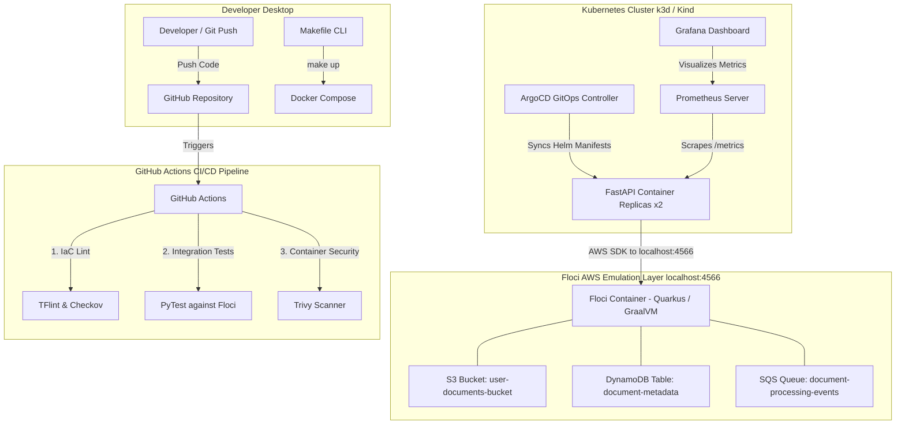

# 🚀 CloudOps Floci Platform: End-to-End GitOps & Cloud Infrastructure

[](https://github.com/Suman-Neupane/devops-floci-platform/actions)
[](https://github.com/Suman-Neupane/devops-floci-platform/actions)
[](https://opensource.org/licenses/MIT)
[](https://github.com/floci/floci)
[](https://www.terraform.io/)
[](https://k3d.io/)

A production-grade, zero-cost DevOps & Cloud Infrastructure platform using **Floci** (high-performance local AWS emulator) alongside **Terraform**, **FastAPI**, **Kubernetes (k3d)**, **Helm**, **ArgoCD (GitOps)**, and **Prometheus/Grafana**.

---

## 🏛️ Architecture Overview



---

## 🌟 Key Features & Tech Stack

| Component | Technology | Purpose |
| :--- | :--- | :--- |
| **AWS Emulator** | **Floci** | Local native binary AWS emulator starting in ~25ms with 15MB RAM footprint on port `4566`. |
| **Infrastructure as Code** | **Terraform** | Modular IaC defining S3, DynamoDB, SQS with custom endpoint overrides (`http://localhost:4566`). |
| **Microservice** | **FastAPI + Boto3** | Async Python REST service processing file uploads to S3, records to DynamoDB, and events to SQS. |
| **Containerization** | **Docker** | Multi-stage security-hardened Dockerfile running under non-root user account. |
| **Kubernetes Packaging** | **Helm** | Templated Kubernetes manifests with configurable probes, resources, and environment bindings. |
| **GitOps Deployment** | **ArgoCD** | Automated continuous deployment syncing Kubernetes state directly from Git commits. |
| **Observability** | **Prometheus + Grafana** | Custom dashboard tracking request rates, p95 latency, and cluster metric scrapers. |
| **DevSecOps & CI** | **GitHub Actions + Trivy + Checkov** | Automated pipeline running container scans, integration tests, and static analysis. |

---

## ⚡ Quickstart Guide

### Prerequisites
- [Docker & Docker Compose](https://docs.docker.com/get-docker/)
- [Terraform](https://developer.hashicorp.com/terraform/downloads) (>= 1.5.0)
- [Python 3.11+](https://www.python.org/)
- `make` utility

### 1. Launch Floci AWS Emulator
```bash
make floci-up
```
*Floci will start on `http://localhost:4566`.*

### 2. Provision Infrastructure via Terraform
```bash
make tf-init
make tf-apply
```
*This creates the S3 bucket, DynamoDB table, and SQS queue locally on Floci.*

### 3. Run FastAPI Application
```bash
make app-run
```
*The service will be available at `http://localhost:8000`. Access interactive API docs at `http://localhost:8000/docs`.*

### 4. Run Integration Test Suite
```bash
make test
```
*Runs PyTest assertions verifying real upload, S3 object storage, DynamoDB persistence, and SQS messaging against Floci.*

---

## 🧪 Testing the API via cURL

### Upload a Document
```bash
curl -X POST "http://localhost:8000/upload" \
  -H "accept: application/json" \
  -H "Content-Type: multipart/form-data" \
  -F "file=@README.md"
```

### List Uploaded Documents
```bash
curl -X GET "http://localhost:8000/documents"
```

---

## 🇩🇪 CV Highlights for German Engineering Roles (Werkstudent / Junior)

When applying for DevOps / Cloud Engineering roles in Germany, use these resume bullet points:

- **Infrastructure as Code**: *"Designed and provisioned modular AWS infrastructure (S3, DynamoDB, SQS) using **Terraform** targeting **Floci** local emulator to eliminate cloud dev costs."*
- **Container Orchestration & GitOps**: *"Packaged microservices with **Helm** and configured automated declarative deployment via **ArgoCD** on a local **k3d Kubernetes** cluster."*
- **Observability & DevSecOps**: *"Implemented a full-stack **GitHub Actions** CI/CD pipeline integrated with **Trivy** vulnerability scanning, **Checkov** static analysis, and **Prometheus/Grafana** telemetry."*

---

## 📄 License
This project is licensed under the MIT License - see the [LICENSE](LICENSE) file for details.
